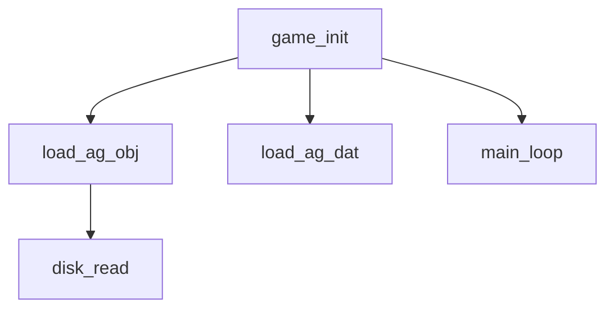

# AtariHacker Usage Guide

A command-line toolkit for reverse-engineering **Atari 8-bit binaries**, **ROM images**, and **ATR disk images**. It provides 6502 disassembly with multi-pass analysis, code/data separation, segment-aware output, ATR file manipulation, batch scripting, and a comprehensive Atari hardware symbol table spanning GTIA, POKEY, PIA, ANTIC, OS ROM entry points, and zero-page OS variables.

---

## Table of Contents

1. [Installation & Quick Start](#1-installation--quick-start)
2. [Global Options & Configuration](#2-global-options--configuration)
3. [Specifying Addresses and Offsets](#3-specifying-addresses-and-offsets)
4. [Command Reference](#4-command-reference)
   - [`load` — Load Files into Session](#41-load--load-files-into-session)
   - [`info` — Display Loaded Binary Info](#42-info--display-loaded-binary-info)
   - [`script` — Execute Batch Scripts](#43-script--execute-batch-scripts)
   - [`disassemble` — 6502 Disassembly](#44-disassemble--6502-disassembly)
   - [`hex-dump` — Hex Dump with ASCII](#45-hex-dump--hex-dump-with-ascii)
   - [`find-pattern` — Byte Pattern Search](#46-find-pattern--byte-pattern-search)
   - [`find-strings` — ASCII / ATASCII String Search](#47-find-strings--ascii--atascii-string-search)
   - [`analyze` — Multi-Pass Analysis](#48-analyze--multi-pass-analysis)
   - [`probe` — Data Type Identification](#49-probe--data-type-identification)
   - [`callgraph` — Call Graph Generation](#410-callgraph--call-graph-generation)
   - [`coverage` — Code Coverage Analysis](#411-coverage--code-coverage-analysis)
   - [`trace` — Static Execution Tracing](#412-trace--static-execution-tracing)
   - [`xref` — Cross-Reference Search](#413-xref--cross-reference-search)
   - [`symbol` — Symbol/Label Management](#414-symbol--symbol--label-management)
   - [`segment` — Memory Segment Management](#415-segment--memory-segment-management)
   - [`zero-page` — Zero Page Annotations](#416-zero-page--zero-page-annotations)
   - [`labels` — Load/Save Sidecar Files](#417-labels--load--save-sidecar-files)
   - [`atr` — ATR Disk Image Operations](#418-atr--atr-disk-image-operations)
   - [`diff` — Binary File Comparison](#419-diff--binary-file-comparison)
   - [`hex-to-decimal` / `decimal-to-hex` — Conversion Utilities](#420-hex-to-decimal--decimal-to-hex--conversion-utilities)
5. [Multi-Pass Analysis Engine](#5-multi-pass-analysis-engine)
6. [Data Probing Heuristics](#6-data-probing-heuristics)
7. [Atari Hardware Symbol Table](#7-atari-hardware-symbol-table)
8. [Session Persistence & Sidecar Files](#8-session-persistence--sidecar-files)
9. [Batch Scripting Reference](#9-batch-scripting-reference)
10. [Example Workflows](#10-example-workflows)

---

## 1. Quick Start


### Quick Start

```bash
# Load a target and run a command in one step
atarihacker --target game.rom info

# Or use a config file to avoid repeating the target
echo '{"target": "game.rom"}' > .atari-hacker.config
atarihacker info
atarihacker disassemble 0 100
```

---

## 2. Global Options & Configuration

### Command-Line Options

| Option | Description |
|--------|-------------|
| `-t, --target <path>` | Target file path (ATR, ROM, XEX). Overrides `.atari-hacker.config`. |
| `-c, --config <path>` | Path to config file. Default: searches current and parent directories for `.atari-hacker.config`. |
| `--version` | Show version information |
| `-?, -h, --help` | Show help |

### Config File

The `.atari-hacker.config` file is a simple JSON file that specifies the default target:

```json
{
  "target": "path/to/your/file.atr"
}
```

When a config file is present, the `--target` option can be omitted. The config file is searched **upward** from the current directory, so you can place it in a project root.

### How Target Resolution Works

1. If `--target <path>` is provided on the CLI, that path is used.
2. Otherwise, the `.atari-hacker.config` file is searched for (upward from the current directory).
3. If no target is found through either method, an error is returned.

When loading an ATR/ATX file, the boot sectors are extracted and loaded as a raw binary. When loading a ROM or XEX file, the file is loaded as-is, with XEX headers parsed to extract segments, run address, and init address.

---

## 3. Specifying Addresses and Offsets

All numeric parameters (addresses, offsets, etc.) accept three formats:

| Format | Example | Description |
|--------|---------|-------------|
| Hex with `$` prefix | `$700` | Standard Atari assembler convention |
| Hex with `0x` prefix | `0x700` | C/Python convention |
| Decimal | `1792` | Plain integer |

If a hex value contains any hex digits (`A`–`F`), it is **always** parsed as hex even without a prefix. To be explicit, always use `$` or `0x` prefix.

```bash
# These are all equivalent
atarihacker disassemble 0x700 256
atarihacker disassemble $700 256
atarihacker disassemble 1792 256
```

---

## 4. Command Reference

### 4.1 `load` — Load Files into Session

```
load <path>
```

Loads a ROM, XEX, or ATR file into the current session. For ATR images, the boot sectors are extracted automatically. For XEX files, the file header is parsed to extract load segments, run address, and init address.

```bash
atarihacker load game.xex
atarihacker load game.rom
atarihacker load disk.atr
```

**Output example (XEX):**
```
Loaded ROM: /path/to/game.xex
File path : /path/to/game.xex
File size : 13312 bytes ($3400)
Format    : XEX
Segment 1: $0700 - $087F  (384 bytes, file offset $0004)
Segment 2: $0C00 - $1CFF  (4352 bytes, file offset $0184)
Run address : $1540 (game_init)
Init address: $0700
Sidecar   : loaded
```

---

### 4.2 `info` — Display Loaded Binary Info

```
info
```

Displays information about the currently loaded binary without needing a path argument (the target is resolved from `--target` or config). Shows file path, size, format type, XEX segments (if applicable), run/init addresses, and sidecar status.

```bash
atarihacker -t game.rom -- info
```

---

### 4.3 `script` — Execute Batch Scripts

```
script <path>
```

Executes a sequence of commands from a text file. The script format uses `command key=value` syntax with optional quoting.

**Script file format:**
```text
# This is a comment (lines starting with #)
load_rom filePath=game.xex
define_symbol address=$1540 label=game_init
define_segment name=boot_loader start=$0700 end=$087F type=code
define_segment name=main_code start=$0C00 end=$1CFF type=code
disassemble offset=$0700 numBytes=384 format=ca65 startAddress=game_init
generate_linker_config output=game.cfg
save_labels filePath=game.annotations.json
```

**Execution:**
```bash
atarihacker script disassemble_all.txt
```

The script runner supports quoted values for parameters containing spaces, and stops on the first error. Output redirection (`>`) in script lines is handled transparently.

---

### 4.4 `disassemble` — 6502 Disassembly

```
disassemble <offset> <bytes> [options]
```

Disassembles 6502 machine code from the loaded binary. The command supports multiple output formats and an analysis mode for intelligent label generation.

**Arguments:**

| Argument | Description |
|----------|-------------|
| `offset` | File offset to start disassembly (decimal or hex) |
| `bytes` | Number of bytes to disassemble |

**Options:**

| Option | Description |
|--------|-------------|
| `--start-address <addr>` | Override the memory start address |
| `--format <format>` | Output format: `listing` (default), `ca65`, `atasm`, or `mac65` |
| `--analyze` | Use multi-pass analysis for label generation and code/data separation |

#### Format Details

**`listing`** (default) — Classic format showing address, bytes, and disassembly with comments:
```
$0700  A9 00     LDA #$00
$0702  8D 00 D4  STA DMACTL   ; GTIA DMA control
$0705  60        RTS
```

**`ca65`** — cc65-compatible assembler output with `.org`, `.byte`, and label support:
```ca65
        .org    $0700
L0700:
        lda     #$00
        sta     DMACTL
        rts
```

**`atasm`** — ATASM-compatible output with space-delimited labels:
```atasm
        .org    $0700
L0700
        lda     #$00
        sta     DMACTL
        rts
```

**`mac65`** — Mac/65-compatible output with `ORG`/`DB` directives:
```mac65
        ORG     $0700
L0700
        lda     #$00
        sta     DMACTL
        rts
```

#### Analysis Mode (`--analyze`)

When `--analyze` is used, the engine performs multi-pass analysis (see [Section 5](#5-multi-pass-analysis-engine)) and generates:

- **Meaningful labels** like `sub_XXXX`, `data_XXXX`, `jmp_XXXX`, `L_XXXX`
- **Code/data separation** — bytes identified as data use `.byte` directives
- **Procedure detection** — subroutines wrapped in `.proc`/`.endproc` blocks with call/caller headers
- **Segment-aware output** — `.segment` directives when segments are defined
- **ATASCII string formatting** — printable ATASCII bytes rendered as string literals
- **Hardware register symbols** — known Atari register names (DMACTL, AUDF1, etc.) shown in operands

**Example ca65 analyzed output:**
```ca65
; --------------------------------------------------
; Generated by Atari Hacker MCP v4
; Source: game.xex
; --------------------------------------------------

.segment "MAIN_CODE"
        .org    $0C00

; --------------------------------------------------
; Subroutine: sub_1540
; Calls:     sub_1600, sub_1800
; Called by: sub_0C00
; --------------------------------------------------
.proc sub_1540
        lda     #$00
        sta     DMACTL          ; $D400
        lda     #$22
        sta     DLISTL          ; $D402
        rts
.endproc
```

#### Examples

```bash
# Basic listing
atarihacker disassemble 0 100

# With address override and analysis
atarihacker disassemble $700 384 --start-address $0700 --analyze

# ca65 format for assembler integration
atarihacker disassemble $0C00 5376 --format ca65 --analyze
```

---

### 4.5 `hex-dump` — Hex Dump with ASCII

```
hex-dump <offset> <bytes> [options]
```

Produces a formatted hex dump with file offsets, memory addresses, and ASCII representation. Each row shows 16 bytes with their hex values and printable ASCII characters (non-printable bytes shown as `.`).

**Options:**

| Option | Description |
|--------|-------------|
| `--start-address <addr>` | Override the memory start address shown in the dump |

**Output format:**
```
Offset    Address   00 01 02 03 04 05 06 07 08 09 0A 0B 0C 0D 0E 0F  ASCII
--------  --------  -----------------------------------------------  ----------------
$00000000  $0700    A9 00 8D 00 D4 A9 22 8D 02 D4 60 00 00 00 00 00  ......."....`.....
$00000010  $0710    4C 20 07 4C 30 07 00 FF FF 00 00 00 00 00 00 00  L .L0.............
```

```bash
atarihacker hex-dump 0 256
atarihacker hex-dump $100 128 --start-address $0800
```

---

### 4.6 `find-pattern` — Byte Pattern Search

```
find-pattern <pattern> [options]
```

Searches the loaded binary for a byte pattern with optional wildcards.

**Arguments:**

| Argument | Description |
|----------|-------------|
| `pattern` | Space-separated hex bytes. Use `??` for wildcard bytes. |

**Options:**

| Option | Default | Description |
|--------|---------|-------------|
| `--max-results <n>` | 50 | Maximum number of matches to return |

**Examples:**
```bash
# Find a specific sequence
atarihacker find-pattern "A9 00 8D 00 D4"

# With wildcards for variable bytes
atarihacker find-pattern "A9 ?? 8D"

# Search for JSR $E400 (SIO init)
atarihacker find-pattern "20 00 E4"
```

Each result shows the file offset, corresponding memory address (if resolvable), and the matched bytes.

---

### 4.7 `find-strings` — ASCII / ATASCII String Search

```
find-strings [options]
```

Searches for runs of printable characters in the loaded binary.

**Options:**

| Option | Default | Description |
|--------|---------|-------------|
| `--min-length <n>` | 4 | Minimum string length to report |
| `--encoding <enc>` | `ascii` | String encoding: `ascii` or `atascii` |
| `--filter <text>` | — | Optional substring filter (case-insensitive) |
| `--max-results <n>` | 50 | Maximum number of results |

**Encoding details:**
- **`ascii`** — Standard ASCII printable range (`0x20`–`0x7E`)
- **`atascii`** — Atari ATASCII encoding, including inverse video characters and `$9B` (ATASCII EOL marker). Inverse characters are prefixed with `~` in output.

**Examples:**
```bash
# Find standard ASCII strings
atarihacker find-strings

# Find ATASCII strings with minimum length 8
atarihacker find-strings --encoding atascii --min-length 8

# Search for strings containing "score"
atarihacker find-strings --filter score

# Limit to 10 results
atarihacker find-strings --max-results 10
```

**Sample output:**
```
Strings found (ascii, minLen=4):
  $0000 / $0700  [5 bytes] "SCORE"
  $0042 / $0742  [12 bytes] "HIGH SCORES"
  $0100 / $0800  [9 bytes] "GAME OVER"
```

---

### 4.8 `analyze` — Multi-Pass Analysis

```
analyze [options]
```

Performs multi-pass analysis to build a reference graph and identify code/data regions across the loaded binary.

**Options:**

| Option | Description |
|--------|-------------|
| `--start-address <addr>` | Starting address for analysis (hex) |
| `--bytes <n>` | Number of bytes to analyze |
| `--format <fmt>` | Output format: `summary` (default), `graph`, `labels`, or `full` |

#### Output Formats

**`summary`** — High-level statistics on the analysis results:
```
Disassembly Analysis:
  Code entry points: 15
  Data references: 42
  Branch targets: 38
  Subroutines: 12
  Code bytes: 2350 (72.3%)
  Data bytes: 902 (27.7%)
  ---
  Subroutine entries:
    $0700 (sub_0700)
    $1540 (game_init)
    $1600 (load_ag_obj)
    ...
  ---
  Unreferenced code regions (potential dead code or data):
    $0F00–$0F2A (43 bytes)
    $1720–$1AFF (992 bytes)
```

**`graph`** — Detailed listing of all reference types found:
```
Reference Graph:
  Subroutine entries (12):
    $0700 → sub_0700
    $1540 → game_init
    ...
  Jump targets (5):
    $0800
  Data references (42):
    $1D00
    ...
```

**`labels`** — All auto-generated labels with comments:
```
Generated Labels:
  $0700  sub_0700
  $1540  game_init    ; Main game entry point
  $1600  load_ag_obj
  $1D00  data_1D00
  ...
```

**`full`** — Complete analysis combining all of the above.

```bash
# Quick summary
atarihacker analyze

# View auto-generated labels
atarihacker analyze --format labels

# Focused analysis on a range
atarihacker analyze --start-address $0C00 --bytes 4096
```

---

### 4.9 `probe` — Data Type Identification

```
probe <start> <end>
```

Analyzes a memory range to identify the likely data type using seven heuristic detection methods. This is invaluable for understanding unknown data regions in a ROM.

**Arguments:**

| Argument | Description |
|----------|-------------|
| `start` | Start address (hex) |
| `end` | End address (hex, inclusive) |

```bash
atarihacker probe $1D00 $1FFF
```

**Detection heuristics** (see [Section 6](#6-data-probing-heuristics) for full details):

| Heuristic | Detects |
|-----------|---------|
| String detection | ATASCII/ASCII printable runs, `$9B`-terminated, null-terminated |
| Padding detection | Runs of `$00`, `$FF`, `$1A` |
| Character set | 1024-byte (128×8) and 512-byte (64×8) blocks |
| Table detection | 2-byte address tables, 1-byte lookup tables |
| Display list | ANTIC display list opcodes with LMS extraction |
| Sprite data | 8/16/32-byte aligned blocks with byte variety analysis |
| Map data | 2D grid patterns with consistent row lengths |

Each result includes a **confidence level** (High / Medium / Low) and supporting details.

**Sample output:**
```
$1D00–$1FFF: ATASCII/ASCII text (768 bytes)
  Confidence: High
  Strings detected: 12
  Structure: $9B-terminated string table (ATASCII EOL)
  "SCORE"
  "HIGH SCORES"
  "GAME OVER"
  "CREDITS"
  "LEVEL"
```

---

### 4.10 `callgraph` — Call Graph Generation

```
callgraph [options]
```

Generates a call graph showing subroutine relationships based on JSR instructions found in the binary.

**Options:**

| Option | Default | Description |
|--------|---------|-------------|
| `--start-address <addr>` | — | Root address for the call graph (hex) |
| `--depth <n>` | 3 | Maximum call depth |
| `--format <fmt>` | `mermaid` | Output format: `mermaid` or `text` |

#### Mermaid Format

Outputs a [Mermaid](https://mermaid.js.org/) flowchart that can be rendered in Markdown-compatible editors or tools:



#### Text Format

Outputs an indented text tree:

```
game_init
  load_ag_obj
    disk_read
  load_ag_dat
    disk_read
  main_loop
    read_input
    update_screen
```

```bash
# With a specific root
atarihacker callgraph --start-address $1540 --depth 5 --format mermaid

# Text format for terminal viewing
atarihacker callgraph --depth 4 --format text
```

---

### 4.11 `coverage` — Code Coverage Analysis

```
coverage <start> <end>
```

Analyzes which bytes in an address range are classified as code versus data by the multi-pass analysis engine.

**Arguments:**

| Argument | Description |
|----------|-------------|
| `start` | Start address (hex) |
| `end` | End address (hex, inclusive) |

```bash
atarihacker coverage $0C00 $1CFF
```

**Sample output:**
```
Coverage Analysis: $0C00–$1CFF
  $0C00–$1540: 100% code (code)
  $1541–$16FF: 85% code, 15% data (mixed)
  $1700–$1CFF: 0% code, 100% data (data)
  ---
  Total: 72% code, 28% data
  Orphaned code: 0 bytes (0.0%)
  Embedded data: 45 bytes
```

---

### 4.12 `trace` — Static Execution Tracing

```
trace <address> [options]
```

Statically traces execution flow from a given starting address, following JSR calls, JMP jumps, and branch instructions through the code. This simulates the CPU's execution path without actually running the code.

**Arguments:**

| Argument | Description |
|----------|-------------|
| `address` | Starting memory address |

**Options:**

| Option | Default | Description |
|--------|---------|-------------|
| `--max-depth <n>` | 5 | Maximum call depth for JSR tracing |
| `--max-instructions <n>` | 500 | Instruction budget to prevent runaway analysis |

The tracer:
- Follows sequential execution until `RTS`, `RTI`, or `BRK`
- Descends into `JSR` calls up to `--max-depth` levels
- Follows `JMP absolute` and branch instructions
- Stops at indirect jumps (`JMP (addr)`) — these cannot be resolved statically
- Detects loops and infinite cycles
- Shows labels and hardware register names in the trace

**Note about boot sectors:** If the address at `$0700` disassembles as `BRK` (opcode `$00`), the tool provides a hint that the actual boot code starts at `$0706` (after the 6-byte boot header).

```bash
atarihacker trace $0700
atarihacker trace $1540 --max-depth 10 --max-instructions 1000
```

**Sample output:**
```
$0700 (boot_start)
  $0700  LDA #$00
  $0702  STA DMACTL
  $0704  STA AUDF1
  $0706  JSR sub_0800
  $0800 (sub_0800)
    $0800  LDX #$00
    $0802  LDA $0600,X
    ...
    $0810  RTS
  $0709  JMP $0700 [loop]
```

---

### 4.13 `xref` — Cross-Reference Search

```
xref <address>
```

Finds all instructions in the loaded binary that reference a target memory address. References are grouped by instruction type and include the mnemonic and formatted operand.

**Arguments:**

| Argument | Description |
|----------|-------------|
| `address` | Target address to cross-reference |

```bash
atarihacker xref $D400
atarihacker xref $1540
```

**Sample output:**
```
Cross-references to $D400 (DMACTL):
  LDA:
    $0C12  LDA DMACTL
    $1550  LDA DMACTL
  STA:
    $0702  STA DMACTL
    $0C80  STA DMACTL
    $1542  STA DMACTL
```

---

### 4.14 `symbol` — Symbol / Label Management

Manages named labels for memory addresses. Symbols are used in disassembly output to replace raw addresses with meaningful names.

#### `symbol define <address> <label>`

Add or update a named label for a memory address.

**Arguments:**

| Argument | Description |
|----------|-------------|
| `address` | Memory address |
| `label` | Label name (must match `[A-Za-z_][A-Za-z0-9_]*`) |

**Options:**

| Option | Description |
|--------|-------------|
| `--comment <text>` | Optional comment |

```bash
atarihacker symbol define $1540 game_init --comment "Main game entry point"
```

#### `symbol remove <address>`

Remove a user-defined symbol. Hardware symbols cannot be removed.

**Arguments:**

| Argument | Description |
|----------|-------------|
| `address` | Address of the symbol to remove |

```bash
atarihacker symbol remove $1540
```

#### `symbol lookup <address>`

Look up the symbol entry for an address, showing label, comment, whether it's a hardware register, and whether it's user-defined.

```bash
atarihacker symbol lookup $D400
```

**Output example:**
```
Address      : $D400
Label        : DMACTL
Comment      : GTIA DMA control
Hardware     : True
User-defined : False
```

#### `symbol list [options]`

List symbols in the symbol table.

**Options:**

| Option | Default | Description |
|--------|---------|-------------|
| `--include-hardware` | — | Include built-in hardware symbols |
| `--filter <text>` | — | Optional substring filter |

```bash
# List only user-defined symbols
atarihacker symbol list

# List all symbols including hardware
atarihacker symbol list --include-hardware

# Filter by name
atarihacker symbol list --filter "DMA" --include-hardware
```

#### `symbol set [options]`

Enable or disable groups of built-in symbols. This is useful when user code overlaps with OS ROM address ranges or when you want to simplify the disassembly output.

**Options:**

| Option | Description |
|--------|-------------|
| `--hardware <bool>` | Enable hardware register symbols (GTIA, POKEY, PIA, ANTIC) |
| `--os-variables <bool>` | Enable OS zero-page variable symbols |
| `--os-rom <bool>` | Enable OS ROM entry point symbols |
| `--user-labels <bool>` | Enable user-defined symbols |

```bash
# Disable hardware symbols
atarihacker symbol set --hardware false

# Enable only user labels and OS variables
atarihacker symbol set --hardware false --os-rom false --user-labels true --os-variables true
```

---

### 4.15 `segment` — Memory Segment Management

Defines named memory regions with types, enabling segment-aware disassembly and cc65 linker configuration generation.

#### `segment define <name> <type> <start> <end>`

Define a memory segment by type.

**Arguments:**

| Argument | Description |
|----------|-------------|
| `name` | Segment name (e.g., `boot_loader`, `main_code`) |
| `type` | Segment type: `code`, `data`, `graphics`, `text`, or `zero_page` |
| `start` | Start address (hex) |
| `end` | End address, inclusive (hex) |

**Options:**

| Option | Description |
|--------|-------------|
| `--comment <text>` | Optional comment |

Duplicating the `--comment` flag: the `--comment` option provides an optional comment for the segment.

```bash
atarihacker segment define name=boot_loader start=$0700 end=$087F type=code
atarihacker segment define name=main_code start=$0C00 end=$1CFF type=code --comment "Main game code"
atarihacker segment define name=game_data start=$1D00 end=$BBA4 type=data
```

If segment overlaps are detected, a warning is shown but the segment is still defined.

#### `segment remove <name>`

Remove a defined memory segment by name.

```bash
atarihacker segment remove boot_loader
```

#### `segment list`

List all defined memory segments and show gaps between them.

```bash
atarihacker segment list
```

**Output example:**
```
Segments (3 defined):

  boot_loader          code       $0700–$087F
  main_code            code       $0C00–$1CFF  ; Main game code
  game_data            data       $1D00–$BBA4

Gaps between segments:
  $0880–$0BFF (896 bytes)
```

#### `segment clear`

Clear all defined segments.

```bash
atarihacker segment clear
```

#### `segment linker-config <output>`

Generate a [cc65](https://cc65.github.io/) linker configuration file from the current segments. Zero-page segments are excluded from the memory layout.

```bash
atarihacker segment define name=main_code start=$0C00 end=$1CFF type=code
atarihacker segment linker-config game.cfg
```

**Generated output (`game.cfg`):**
```cfg
FEATURES {
    STARTADDRESS = default;
}
SYMBOLS {
    __STACKSIZE__: type = weak, value = $0800;
}

MEMORY {
    MAIN_CODE: start = $0C00, size = $1100, type = rw;
}

SEGMENTS {
    MAIN_CODE: load = MAIN_CODE, type = rw;
}
```

---

### 4.16 `zero-page` — Zero Page Annotations

Manages annotations for zero-page memory addresses (`$00`–`$FF`). The built-in symbol table includes ~220 OS zero-page variable entries, and additional user annotations can be added.

#### `zero-page annotate <address> <label>`

Add or update a zero page annotation.

**Arguments:**

| Argument | Description |
|----------|-------------|
| `address` | Zero page address (0–255) |
| `label` | Label to assign |

**Options:**

| Option | Description |
|--------|-------------|
| `--comment <text>` | Optional comment |

```bash
atarihacker zero-page annotate $80 user_ptr --comment "Pointer to user data"
```

#### `zero-page show [options]`

Display zero page annotations.

**Options:**

| Option | Default | Description |
|--------|---------|-------------|
| `--all` | — | Show all 256 bytes of zero page with byte values and annotations |

```bash
# Show only annotated addresses
atarihacker zero-page show

# Show full zero page map with byte values
atarihacker zero-page show --all
```

**Output example (annotated only):**
```
$80  user_ptr  ; Pointer to user data
$D0  COLOR0   ; Playfield color 0 shadow
$D4  COLOR4   ; Playfield color 4 shadow
```

**Output with `--all`:**
```
Zero page bytes:
00: 00 00 00 00 00 00 00 00 00 00 00 00 00 00 00 00    $00=LINZBS0, $01=LINZBS1
10: 00 00 00 00 00 00 00 00 00 00 00 00 00 00 00 00    $10=FR0_0
...
80: 00 00 00 00 00 00 00 00 00 00 00 00 00 00 00 00    $80=user_ptr

Annotations:
$80  user_ptr  ; Pointer to user data
```

---

### 4.17 `labels` — Load / Save Sidecar Files

Persists and restores user-defined symbols, zero-page annotations, and segment definitions using JSON sidecar files.

#### `labels load <path>`

Load labels, zero-page annotations, and segments from a sidecar file.

**Arguments:**

| Argument | Description |
|----------|-------------|
| `path` | Path to the sidecar file (`*.atarihacker.json`) |

```bash
atarihacker labels load game.atarihacker.json
```

#### `labels save [options]`

Save current labels, zero-page annotations, and segments to a sidecar file.

**Options:**

| Option | Description |
|--------|-------------|
| `--output <path>` | Optional output path (defaults to ROM path + `.atarihacker.json`) |

```bash
# Save to default sidecar path (next to ROM)
atarihacker labels save

# Save to a specific location
atarihacker labels save --output game.annotations.json
```

The sidecar file is automatically loaded when a ROM is loaded (via `load` or `--target`) if the corresponding `.atarihacker.json` file exists next to the ROM. See [Section 8](#8-session-persistence--sidecar-files) for details.

---

### 4.18 `atr` — ATR Disk Image Operations

Comprehensive toolkit for working with ATR (Atari disk image) files, including inspection, creation, file extraction/injection, and custom filesystem support.

#### `atr info <path>`

Display structural information about an ATR disk image, including density, sector count, free space, and a directory listing.

```bash
atarihacker atr info disk.atr
```

**Output example:**
```
ATR Disk Image: /path/to/disk.atr
Density  : Single (SD)
Sectors  : 720 x 128 bytes = 92,160 bytes

Free     : 680 sectors

Directory:
  #  Filename     Ext  Sectors  Bytes   Start  Flags
  0  AGENT        OBJ     20    1728     1      [binary]
  1  AUTORUN      SYS      8     684    25
  2  SCREEN       DAT     18    1600    33
```

#### `atr header <path>`

Display the raw ATR header fields (magic bytes, image size, sector size, sector count, density, write-protect flag).

```bash
atarihacker atr header disk.atr
```

**Output:**
```
ATR Header: /path/to/disk.atr
  Magic:         $0296
  Image size:    92160 bytes (1440 paragraphs)
  Sector size:   128 bytes
  Sector count:  720
  Density:       Single (SD)
  Write protect: No
```

#### `atr directory <path>`

List the directory of a DOS-formatted ATR disk image. Shows active files with their sector counts, start sectors, and flags (binary, locked). Also shows deleted files count and free space.

```bash
atarihacker atr directory disk.atr
```

**Output:**
```
ATR Directory: /path/to/disk.atr
  #  Filename     Ext  Sectors  Start   Flags
  0  AGENT        OBJ     20     1      [binary]
  1  AUTORUN      SYS      8     25     []
  2  SCREEN       DAT     18     33     []

3 files, 46 sectors used, 674 sectors free
```

#### `atr create <output> <sectors> <density>`

Create a new blank ATR disk image from scratch.

**Arguments:**

| Argument | Description |
|----------|-------------|
| `output` | Output file path |
| `sectors` | Number of sectors (e.g., 720, 1040) |
| `density` | Density: `sd` (single, 128-byte sectors), `dd` (double, 256-byte), `ed` (enhanced, 128-byte) |

**Density specifications:**

| Density | Sector Size | Typical Use |
|---------|-------------|-------------|
| `sd` | 128 bytes | Single-density, 720 sectors = 90 KB |
| `dd` | 256 bytes | Double-density, 720 sectors = 180 KB |
| `ed` | 128 bytes | Enhanced-density, 1040 sectors = 130 KB |

```bash
# Create single-density 720-sector disk
atarihacker atr create build/disk.atr 720 sd

# Create double-density disk
atarihacker atr create build/disk.atr 720 dd

# Create enhanced-density disk
atarihacker atr create build/disk.atr 1040 ed
```

#### `atr extract <path> <name> <output>`

Extract a file from an ATR image and save it to the host filesystem.

**Arguments:**

| Argument | Description |
|----------|-------------|
| `path` | Path to the ATR file |
| `name` | Atari DOS filename (e.g., `AGENT.OBJ`) |
| `output` | Output path on the host filesystem |

```bash
atarihacker atr extract game.atr AGENT.OBJ extracted/AGENT.OBJ
```

#### `atr inject <path> <name> <input>`

Inject a file into an ATR image, replacing an existing directory entry's data. Uses **copy-on-write**: the original ATR is not modified; a `.modified` copy is created (e.g., `disk.modified.atr`).

**Important:** The input file must fit within the sector allocation of the existing file entry. If the file exceeds the available capacity, an error is returned.

**Arguments:**

| Argument | Description |
|----------|-------------|
| `path` | Path to the ATR file |
| `name` | Atari DOS filename to replace |
| `input` | Path to the input file |

```bash
atarihacker atr inject game.atr AGENT.OBJ build/AGENT.OBJ
```

#### `atr write-sector <path> <sector> <input>`

Write raw binary data to a specific sector of an ATR image. Uses copy-on-write (creates `.modified` copy).

**Arguments:**

| Argument | Description |
|----------|-------------|
| `path` | Path to the ATR file |
| `sector` | Sector number (1-based) |
| `input` | Path to the input file (must match sector size exactly) |

```bash
# Write a boot sector
atarihacker atr write-sector build/disk.atr 1 boot.bin
```

#### `atr write-file <path> <name> <input>`

Write a file to an ATR image, creating a new directory entry and allocating sectors. Uses copy-on-write (creates `.modified` copy). The directory is scanned for free slots, and sectors are allocated from the end of the disk.

**Arguments:**

| Argument | Description |
|----------|-------------|
| `path` | Path to the ATR file |
| `name` | Atari DOS filename in 8.3 format (e.g., `HELLO.BAS`) |
| `input` | Path to the input file |

**Options:**

| Option | Description |
|--------|-------------|
| `--start-sector <hex>` | Starting sector number for the file data (hex; default: auto-allocate from sector 369) |

```bash
atarihacker atr write-file build/disk.atr AGENT.OBJ build/AGENT.OBJ
```

#### `atr analyze-boot <path>`

Decode and display the boot sector header from an ATR disk image. Shows the boot flag, sector count, load address, init address, and entry point.

```bash
atarihacker atr analyze-boot disk.atr
```

**Output:**
```
Boot Sector Analysis: /path/to/disk.atr
  Boot flag:       $00  (continue loading)
  Sectors to load: 3
  Load address:    $0700
  Init address:    $0700
  Entry point:     $0706  (first instruction after boot header)
  Header bytes:    00 03 00 07 00 07
  DOS boot:        Yes  (DOS boot)
```

#### `atr sector-dump <path> <sector>`

Hex dump one or more sectors from an ATR disk image. Each row shows the sector number and offset within the sector.

**Arguments:**

| Argument | Description |
|----------|-------------|
| `path` | Path to the ATR file |
| `sector` | Starting sector number (1-based) |

**Options:**

| Option | Default | Description |
|--------|---------|-------------|
| `--count <n>` | 1 | Number of consecutive sectors to dump |

```bash
# Dump a single sector
atarihacker atr sector-dump disk.atr 1

# Dump 3 consecutive sectors
atarihacker atr sector-dump disk.atr 1 --count 3
```

#### `atr search-boot <paths>`

Scan boot sectors across multiple ATR images to find patterns or detect differences.

**Arguments:**

| Argument | Description |
|----------|-------------|
| `paths` | One or more paths to ATR files to scan |

**Options:**

| Option | Default | Description |
|--------|---------|-------------|
| `--pattern <hex>` | — | Hex byte pattern with `??` wildcards to search for |
| `--mode <mode>` | `pattern` | Search mode: `pattern` (match hex pattern) or `diff` (pairwise comparison) |

**Pattern mode** searches for a byte pattern in boot sectors:
```bash
atarihacker atr search-boot disk1.atr disk2.atr --pattern "A9 00 8D 00 D4"
```

**Diff mode** performs pairwise comparison of boot sectors across images:
```bash
atarihacker atr search-boot disk1.atr disk2.atr disk3.atr --mode diff
```

In pattern mode without a pattern, it lists boot header info for each image.

#### `atr filesystem <path> <options>`

Define a custom filesystem layout for non-DOS ATR images. This stores the filesystem definition in the sidecar JSON file for use with other ATR commands.

**Arguments:**

| Argument | Description |
|----------|-------------|
| `path` | Path to the ATR file |
| `directory-offset` | File offset of the directory table (hex) |
| `entry-size` | Size of each directory entry in bytes |
| `filename-length` | Length of the filename field |
| `extension-length` | Length of the extension field |
| `start-sector-offset` | Offset of start sector field within an entry |
| `sector-count-offset` | Offset of sector count field within an entry |

```bash
atarihacker atr filesystem custom.atr $1000 32 12 0 4 6
```

---

### 4.19 `diff` — Binary File Comparison

```
diff <file1> <file2> [options]
```

Compares two ROM or ATR files byte-by-byte, identifying differences and grouping them into regions.

**Arguments:**

| Argument | Description |
|----------|-------------|
| `file1` | Path to the first file |
| `file2` | Path to the second file |

**Options:**

| Option | Default | Description |
|--------|---------|-------------|
| `--format <fmt>` | `summary` | Format: `summary`, `verbose`, or `hex` |

#### Format Details

**`summary`** — Displays statistical overview:
```
Diff: game_v1.rom vs game_v2.rom
  Size: 16384 vs 16384 (identical)
  Total differences: 142 bytes
  ---
  Changed regions:
    $0700-$073F (64 bytes) — code/data modification (64 bytes)
    $1540-$158F (80 bytes) — code/data modification (80 bytes)
  ---
  Identical: 16242 / 16384 bytes (99.13%)
```

**`verbose`** — Lists every differing byte with offset and values:
```
Diff: game_v1.rom vs game_v2.rom
Total differences: 142

  $0700: $A9 → $4C
  $0701: $00 → $D0
  ...
```

**`hex`** — Side-by-side hex dump showing both files for each differing region:
```
Hex diff: game_v1.rom vs game_v2.rom

--- Region $0700-$073F (code/data modification (64 bytes)) ---
$0700: A9 00 8D 00 D4 A9 22 8D 02 D4 60 00 00 00 00 00  | 4C D0 07 8D 00 D4 A9 22 8D 02 D4 60 00 00 00 00
$0710: 4C 20 07 4C 30 07 00 FF FF 00 00 00 00 00 00 00  | 4C 30 07 4C 20 07 00 FF FF 00 00 00 00 00 00 00
```

---

### 4.20 `hex-to-decimal` / `decimal-to-hex` — Conversion Utilities

#### `hex-to-decimal <hex>`

Convert a hexadecimal value to decimal.

```bash
atarihacker hex-to-decimal $D400
# Output: $D400 = 54272
```

#### `decimal-to-hex <value>`

Convert a decimal integer to hexadecimal.

```bash
atarihacker decimal-to-hex 54272
# Output: 54272 = $D400
```

---

## 5. Multi-Pass Analysis Engine

When `--analyze` is used with `disassemble` (or via the `analyze` command), the engine performs three passes:

### Pass 1 — Reference Collection

Scans every instruction boundary across the entire loaded binary and records all references into a `ReferenceGraph`:

| Reference Type | Source | Description |
|----------------|--------|-------------|
| **Subroutine entries** | `JSR <addr>` | Targets of subroutine calls |
| **Jump targets** | `JMP <addr>` | Targets of absolute jumps |
| **Branch targets** | `Bxx <addr>` | Targets of conditional branches |
| **Indirect jump targets** | `JMP (<addr>)` | Targets of indirect jumps (potential dispatch tables) |
| **Code entry points** | All of the above combined | All addresses that are entry points |
| **Absolute data references** | `LDA/STA/ADC <abs>` | Absolute addresses used in data operations |
| **Indirect data references** | `LDA/STA (<zp>),Y` | Zero-page indirect pointers |
| **Instruction addresses** | All official opcodes | Memory addresses of all identified instructions |

Data-reference mnemonics include: `LDA`, `STA`, `ADC`, `SBC`, `CMP`, `AND`, `ORA`, `EOR`, `LDX`, `STX`, `LDY`, `STY`, `INC`, `DEC`, `BIT`, `ROL`, `ROR`, `ASL`, `LSR`, `CPX`, `CPY`.

### Pass 2 — Code Region Tracing

Starting from each known code entry point, traces execution flow to determine which bytes are actually code and which are data:

- **Fall-through execution** — follows sequential instruction flow
- **JSR descent** — follows subroutine calls
- **JMP following** — follows absolute jumps
- **Branch tracing** — follows conditional branches to their targets
- **Termination** — stops at `RTS`, `RTI`, `BRK`, and indirect jumps
- **Instruction budget** — capped at 100,000 instructions to prevent runaway

Bytes that are reachable through this tracing process are marked as **code**. All other bytes are marked as **data**. Absolute data references from Pass 1 are always marked as data.

### Pass 3 — Label Generation

Produces meaningful labels with a priority ordering:

| Priority | Label Pattern | Source |
|----------|---------------|--------|
| 1 (highest) | User-defined | `symbol define` command |
| 2 | `sub_XXXX` | JSR targets |
| 3 | `jmp_XXXX` | JMP targets |
| 4 | `data_XXXX` | Absolute data references in data regions |
| 5 | Hardware names | GTIA/POKEY/PIA/ANTIC register symbols |
| 6 | OS variable names | Zero-page OS variable symbols |
| 7 (lowest) | `L_XXXX` | Branch targets |

### Procedure Detection

From the reference graph, the engine identifies subroutine boundaries and generates structured output with:

- Procedure header comments showing the subroutine name, calls, and callers
- `.proc` / `.endproc` wrappers (ca65 format)
- Call graph information

### Limitations

- **Self-modifying code** cannot be resolved statically
- **Jump table dispatch** (`JMP (table,X)`) cannot be traced
- Use `segment define` to manually mark such regions

---

## 6. Data Probing Heuristics

The `probe` command uses seven heuristic detection methods to identify data types in memory ranges. Each heuristic returns a result with confidence level (High / Medium / Low).

### 1. String Detection

Detects runs of printable ATASCII/ASCII characters.

- Identifies `$9B`-terminated (ATASCII EOL) and null-terminated string tables
- Includes inverse video ATASCII characters (bit 7 set)
- Confidence based on string-to-total-bytes ratio

### 2. Padding Detection

Detects runs of common padding bytes:

| Byte Value | Typical Use |
|------------|-------------|
| `$00` | Zero padding, unused memory |
| `$FF` | Unprogrammed EPROM/ROM space |
| `$1A` | ATASCII end-of-file marker |

Confidence is High when padding exceeds 50% of the range.

### 3. Character Set Detection

- **1024 bytes** — 128 characters × 8 bytes each (full ANTIC mode 2 charset)
- **512 bytes** — 64 characters × 8 bytes each (narrow charset)
- Confidence: High when exact size and alignment match

### 4. Table Detection

Detects two types of tabular data:

- **Address tables** — 2-byte little-endian word sequences where >60% of words are valid addresses ($0600–$FFFF)
- **Lookup tables** — 1-byte sequences with non-instruction-like byte distribution

### 5. Display List Detection

Detects ANTIC display list opcodes:

| Opcode Range | Description |
|--------------|-------------|
| `$40`–`$4F` | Blank lines (1–16 scan lines) |
| `$70` | Wait for vertical blank |
| `$80`–`$8F` | Mode lines (text/graphics modes) |
| `$C0`–`$CF` | Mode lines with LMS (load memory scan) |
| `$F0` | Jump to display list address |

Confidence increases with the number of display list opcodes found.

### 6. Sprite Data Detection

Detects 8/16/32-byte aligned data blocks typical of player/missile graphics:

- Checks for block alignment (modulo 8, 16, or 32)
- Requires byte variety (more than 4 unique values across the range)
- Block counts ≥ 2 give Medium confidence

### 7. Map Data Detection

Detects 2D grid patterns typical of tile maps:

- Checks for common row lengths: 20, 24, 30, 40, 48, 60, 80, 96, 120, 160, 200
- Requires ≥ 2 rows for detection
- Checks for byte consistency at row boundaries
- Confidence: Medium

---

## 7. Atari Hardware Symbol Table

The built-in symbol table covers over 200 entries across all major Atari components, organized into four symbol groups that can be toggled independently.

### GTIA ($D000–$D01F) — Hardware Group

22 registers covering player/missile graphics positioning and size, player/missile graphics data, color registers (COLPM0–3, COLPF0–3, COLBK), and control registers (PRIOR, VDELAY, GRACTL, HITCLR, CONSOL).

### POKEY ($D200–$D21F) — Hardware Group

32 registers covering sound channels (AUDF1–4, AUDC1–4, AUDCTL, STIMER), I/O registers (KBCODE, RANDOM, POT0–4, SEROUT, IRQEN/IRQST, SKCTL/SKSTAT), and reserved range.

### PIA ($D300–$D303) — Hardware Group

4 registers: PORTA, PORTB, PACTL, PBCTL (parallel I/O).

### ANTIC ($D400–$D41F) — Hardware Group

20 registers including DMACTL, CHACTL, DLISTL/DLISTH, HSCROL, VSCROL, PMBASE, CHBASE, WSYNC, VCOUNT, NMIEN, NMIST, and reserved range.

### OS ROM Entry Points ($C000–$FFFF) — OS ROM Group

13 entries including SYSVBL, SYSVBV, SETVBV, XITVBV, CIOV, SIOV, and interrupt vectors (NMIVEC, RESVEC, IRQVEC).

### Zero Page OS Variables ($00–$FF) — OS Variables Group

~220 variables covering:

| Range | Purpose |
|-------|---------|
| $00–$07 | Reserved / LINZBS |
| $08–$0F | I/O Control Block (ICCOM, ICBAL/H, ICPTL/H, ICBLL/H, ICAX1Z) |
| $10–$1F | Floating Point Registers (FR0–FR2, EEXP) |
| $20–$3F | User Zero Page (32 bytes available for programs) |
| $40–$4F | OS Variables (NMIEN, RUNAD, INITAD, RAMSIZ, MEMTOP, MEMLO) |
| $50–$5F | OS Variables (cursor, screen, display) |
| $60–$7F | OS Variables (CRSINV, SDLSTL/H, clock, margins, charset) |
| $80–$FF | Cassette buffer, tab stops, paddles, joysticks, triggers, colors, ROWAC |

### Toggling Symbol Groups

Use `symbol set` to enable or disable groups:

```bash
# Disable OS symbols to avoid conflicts when user code overlaps OS ranges
atarihacker symbol set --os-rom false --os-variables false

# Re-enable all groups
atarihacker symbol set --hardware true --os-variables true --os-rom true --user-labels true
```

---

## 8. Session Persistence & Sidecar Files

User-defined symbols, zero-page annotations, and segment definitions are persisted automatically to a JSON sidecar file.

### Sidecar File Location

The sidecar file is saved next to the loaded ROM with the naming convention:
```
<rom-path>.atarihacker.json
```

For example, loading `game.xex` creates/loads `game.xex.atarihacker.json`.

### Sidecar Format (v4)

```json
{
  "version": "4.0",
  "romPath": "/path/to/game.xex",
  "romHash": "sha256hexhash...",
  "symbols": {
    "0x1540": {
      "label": "game_init",
      "comment": "Main game entry point",
      "isHardware": false,
      "isUserDefined": true
    }
  },
  "zeroPage": {
    "0x80": {
      "label": "user_ptr",
      "comment": "Pointer to user data",
      "isHardware": false,
      "isUserDefined": true
    }
  },
  "segments": [
    {
      "name": "main_code",
      "type": "code",
      "start": "0x0C00",
      "end": "0x1CFF",
      "comment": "Main game code"
    }
  ],
  "filesystem": null
}
```

### Automatic Persistence

When a ROM is loaded, the system automatically:
1. Looks for a sidecar file in the same directory
2. Loads user symbols, zero-page annotations, and segments
3. Re-applies hardware symbols (user symbols may override them)
4. Upgrades v3 sidecar files transparently on save

### Integrity Checking

The sidecar includes a SHA-256 hash of the ROM data for integrity verification. This helps detect when the ROM has changed since annotations were created.

---

## 9. Batch Scripting Reference

The `script` command executes sequences of commands from text files, enabling automation of complex workflows.

### Script Syntax

```
# Comment lines start with #
command_name param1=value1 param2=value2
```

- **Command names** are lowercase, underscore-separated
- **Parameters** use `key=value` syntax
- **Quoted values** (`"value with spaces"` or `'value with spaces'`) are supported
- **Blank lines** are ignored
- **Output redirection** (`>`) is stripped from the end of lines
- Execution **stops on first error**

### Available Script Commands

| Script Command | CLI Equivalent | Required Parameters |
|----------------|---------------|-------------------|
| `load_rom` | `load` | `filePath` |
| `rom_info` | `info` | — |
| `disassemble` | `disassemble` | `offset`, `numBytes`; optional: `startAddress`, `format` |
| `hex_dump` | `hex-dump` | `offset`, `numBytes`; optional: `startAddress` |
| `find_pattern` | `find-pattern` | `pattern`; optional: `maxResults` |
| `find_strings` | `find-strings` | optional: `minLength`, `encoding`, `filter`, `maxResults` |
| `analyze_disassembly` | `analyze` | optional: `startAddress`, `numBytes`, `format` |
| `probe_data` | `probe` | `start`, `end` |
| `generate_callgraph` | `callgraph` | optional: `startAddress`, `depth`, `format` |
| `analyze_coverage` | `coverage` | `start`, `end` |
| `trace_control_flow` | `trace` | `address`; optional: `maxDepth` |
| `x_ref` | `xref` | `address` |
| `define_symbol` | `symbol define` | `address`, `label`; optional: `comment` |
| `remove_symbol` | `symbol remove` | `address` |
| `lookup_symbol` | `symbol lookup` | `address` |
| `list_symbols` | `symbol list` | optional: `includeHardware`, `filter` |
| `set_symbols` | `symbol set` | optional: `hardware`, `osVariables`, `osRom`, `userLabels` |
| `define_segment` | `segment define` | `name`, `type`, `start`, `end`; optional: `comment` |
| `remove_segment` | `segment remove` | `name` |
| `list_segments` | `segment list` | — |
| `clear_segments` | `segment clear` | — |
| `generate_linker_config` | `segment linker-config` | `output` |
| `annotate_zero_page` | `zero-page annotate` | `address`, `label`; optional: `comment` |
| `show_zero_page_map` | `zero-page show` | optional: `showUnannotated` |
| `load_labels` | `labels load` | `filePath` |
| `save_labels` | `labels save` | optional: `filePath` |
| `create_atr` | `atr create` | `output`, `sectors`, `density` |
| `extract_atr_file` | `atr extract` | `filePath`, `name`, `output` |
| `inject_atr_file` | `atr inject` | `filePath`, `name`, `input` |
| `write_atr_sector` | `atr write-sector` | `filePath`, `sector`, `input` |
| `write_atr_file` | `atr write-file` | `filePath`, `name`, `input`; optional: `startSector` |
| `define_filesystem` | `atr filesystem` | `filePath`, `directoryOffset`, `entrySize`, `filenameLength`, `extensionLength`, `startSectorOffset`, `sectorCountOffset` |
| `diff_roms` | `diff` | `file1`, `file2`; optional: `format` |
| `hex_to_decimal` | `hex-to-decimal` | `hex` |
| `decimal_to_hex` | `decimal-to-hex` | `value` |

### Example Scripts

**Full disassembly pipeline:**
```text
# Full game disassembly
load_rom filePath=game.xex
define_symbol address=$1540 label=game_init comment="Main game entry point"
define_segment name=boot_loader start=$0700 end=$087F type=code
define_segment name=main_code start=$0C00 end=$1CFF type=code comment="Main game code"
define_segment name=game_data start=$1D00 end=$BBA4 type=data
disassemble offset=$0C00 numBytes=5376 format=ca65 startAddress=$0C00
save_labels filePath=game.annotations.json
```

**ATR analysis workflow:**
```text
analyze_boot_sector path=disk.atr
atr_info path=disk.atr
atr_directory path=disk.atr
```

---

## 10. Example Workflows

### Basic Exploration

```bash
# Set up a config file
echo '{"target": "game.rom"}' > .atari-hacker.config

# Get an overview
atarihacker info

# Examine raw bytes
atarihacker hex-dump 0 256

# Search for strings
atarihacker find-strings
atarihacker find-strings --encoding atascii

# Quick disassembly
atarihacker disassemble 0 100
```

### Analysis-Driven Disassembly

```bash
# Load and perform initial analysis
atarihacker analyze --format summary

# View auto-generated labels
atarihacker analyze --format labels

# Identify data regions
atarihacker probe $1712 $1AD4

# Define segments based on analysis
atarihacker segment define name=main_code start=$0C00 end=$1CFF type=code
atarihacker segment define name=game_data start=$1D00 end=$BBA4 type=data

# Segment-aware disassembly with analysis
atarihacker disassemble $0C00 5376 --format ca65 --analyze

# Visualize the subroutine structure
atarihacker callgraph --start-address $1540 --depth 5 --format mermaid

# Iterate: annotate and re-disassemble
atarihacker symbol define $1540 game_init --comment "Main game entry"
atarihacker disassemble $0C00 5376 --format ca65 --analyze
```

### Iterative Refinement Workflow

1. **Initial analysis** — Get an overview of the binary structure
   ```bash
   atarihacker analyze
   ```

2. **Annotate key addresses** — Add meaningful labels as you identify their purpose
   ```bash
   atarihacker symbol define $1540 game_init --comment "Main game entry"
   atarihacker zero-page annotate $80 temp_ptr --comment "Temp pointer for sprite data"
   ```

3. **Mark code/data regions** — Define segments manually (especially for regions the analyzer can't classify)
   ```bash
   atarihacker segment define name=main_code start=$0C00 end=$1CFF type=code
   ```

4. **Persist annotations** — Save so they survive session resets
   ```bash
   atarihacker labels save
   ```

5. **Re-disassemble with annotations** — See your labels in the output
   ```bash
   atarihacker disassemble $0C00 5376 --format ca65 --analyze
   ```

6. **Review, repeat** — Use `probe`, `xref`, and `trace` to understand new regions

### ATR Modification Workflow

```bash
# 1. Create a blank disk
atarihacker atr create build/disk.atr 720 sd

# 2. Write a custom boot sector
atarihacker atr write-sector build/disk.atr 1 boot.bin

# 3. Add a binary file
atarihacker atr write-file build/disk.atr AGENT.OBJ build/AGENT.OBJ

# 4. Extract a file for inspection
atarihacker atr extract game.atr AGENT.OBJ extracted/AGENT.OBJ

# 5. Modify and re-inject
# (edit extracted/AGENT.OBJ with a hex editor)
atarihacker atr inject game.atr AGENT.OBJ extracted/AGENT.OBJ
```

### Comparing ROM Versions

```bash
# Quick summary
atarihacker diff game_v1.rom game_v2.rom

# Detailed byte-by-byte differences
atarihacker diff game_v1.rom game_v2.rom --format verbose

# Side-by-side hex dump of changed regions
atarihacker diff game_v1.rom game_v2.rom --format hex
```

### Full Batch Automation

Create a script file `analyze_all.txt`:
```text
load_rom filePath=game.xex
analyze_disassembly format=full
probe_data start=$1D00 end=$1FFF
probe_data start=$2000 end=$2FFF
generate_callgraph format=mermaid depth=5
save_labels filePath=game.annotations.json
```

Execute:
```bash
atarihacker script analyze_all.txt
```

---

## Notes

- The `disassemble` command **without** `--analyze` behaves exactly as in v3 — full backward compatibility
- Self-modifying code and jump table dispatch (`JMP (table,X)`) cannot be resolved statically; use `segment define` to mark those regions manually
- All write operations on ATR files use **copy-on-write** semantics — the original file is never modified
- Sidecar files are compatible between v3 and v4 formats; v3 files are read transparently and upgraded on save
